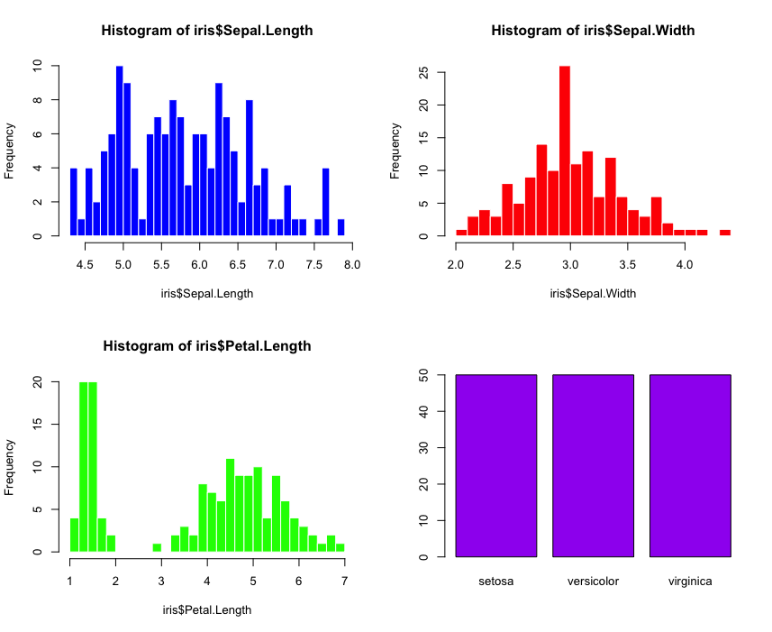

# R 存活指令

> The R survival guide for LADs \(Linguistic Analysis and Data Science\)

\(必修\)

## 三分鐘上手指令

```text
> head(iris)
> str(iris)
> summary(iris)
> plot(iris)
```

## 變數、資料類型與基本運算

variables, data types and basic arithmetic

* 變數與賦值
  * 變數命名大小寫有區別 \(x 和 X 不一樣\)
  * 賦值算子 `<-`，`=` 貌似可以，但 R 官方文件強調不該使用，在某些地方會失效。

```text
> x <- 38
> x
```

* 基本算術運算

  加減乘除、次方、平方根、商數與餘數、指數與對數、等等。

```text
> 20^3
> exp(20)
> logl0(100)
```

* 資料類型 \(data type\) 包含以下幾種，可用 `class()` 函數判斷
  * 文字字串 \(character\)：用 "" 包起來。 `is.character()`
  * 實數 \(或數值\) \(numeric\)：`is.numeric()`
  * 整數 \(integer\)：`is.integer()`
  * 複數 \(complex\)：`is.complex()`
  * 邏輯 \(logical\)：TRUE \(1\) 或 FALSE \(0\) `is.logical()`
  * 日期 \(data\): `as.Data`和 `as.POSTXct` 進一步可考慮 `lubridate` 套件

### 遺失值

R 有兩種記錄遺失/遺漏值的方法：NA 和 NULL。一般資料都有遺漏的部分，在 R 中使用 NA 來表示，

* `NA` \(missing value\) 是保留字，邏輯常數。

  ```text
  > NA <-2
  Error in NA <- 2 : (do_set) 賦值公式左側不正確

  ```

  * 許多函式都帶有 `na.rm` 的 \(刪除\) 參數（預設是 `na.rm = FALSE`）。另外有幾個專門處理 `NA` 內建的函式如下。
    * `is.na()`
    * `na.fail()`
    * `na.pass()`
    * `na.omit()`, `na.exclude()`

```text
> air2 <- na.omit(airquality)
```


```text
> as.character(c(1,3,5))
[1] "1" "3" "5"
> as.integer(c("i", "like","you"))
[1] NA NA NA
Warning message:
強制變更過程中產生了 NA
```

* 文本資料

## 資料匯入與匯出

資料匯入

* `read.table()` 或 `read.csv()`

```text
> cars <- read.csv('/Users/shukai/data4practice/cars.csv', row.names=1)
> # row.names=1 告訴 R 第一列是名稱
```

* 如果要一次載入許多 csv 檔成為不同的 data frame

```text
> folder <- "/Users/shukai/data4practice/"
> file_list <- list.files(path=folder, pattern="*.csv") 
> for (i in 1:length(file_list)){
    assign(file_list[i], 
    read.csv(paste(folder, file_list[i], sep=''))
>     )
> }
```

* 如果要一次載入許多 csv 檔成為同一個 data frame

```text
> data <- 
>   do.call("rbind", 
>           lapply(file_list, 
>                  function(x) 
>                  read.csv(paste(folder, x, sep=''), 
>                  stringsAsFactors = FALSE)))
```

* For unstructured textual data, it is often easier to

  read in the file as lines of texts and then parse the contents afterward. readLines\(\) \(notice the capital "L"\) provides

  such a facility. It accepts a path to a file \(or a file connection\) and, optionally, a maximum number of lines to read.

```text
> alice <- readLines( "http://www.gutenberg.org/ebooks/11.txt.utf-8" )
> alice[1920:1927]
```

* R also provides a powerful function `scan()` to load the contents of text files into _vectors_.
* 文件編碼與轉碼

```text

```

匯出檔案

* 用 `write.table()` 或 `write.csv()` 輸出 csv

```text
> mydata <- rivers 
# rivers 是 R 內建的資料集。
> write.table(mydata, file = "rivers.csv", sep = ",")
> write.csv(mydata, 'rivers.csv', row.names=T)
```

## 資料結構

* R 的底層把絕大部分的資料（包括常數與變數）都以 **向量** 物件的形式呈現。內建的向量稱作「原型向量」\(atomic vector\)；另外可用 `array()`,`list()` 來建立陣列（向量）和列表（向量）等等。這種向量稱為「泛型向量」\(generic vector\)，結構與索引較為複雜，比「原型向量」多了兩個「屬性」\(attribute\)，可用 `attributes()` 得出。
* 相關的內建函式不外乎**建立、查詢、修改資料**。

### 向量 Vector

* 利用 `c()` 建立向量，向量元素必須**是同個資料類型**，不然就會按照 _character &gt; complex &gt; numeric &gt; integer &gt; logical_ 進行資料類型迫轉 \(type coercion\) 

```text
> x <- c(1,2,3)
> y <- c("me","you","they")
> z <- c(x,y)
> z
[1] "1"    "2"    "3"    "me"   "you"  "they"
```

* `seq()` 可建立序列 \(sequence\) 向量 

```text
> seq(from = -10, to = 10, by = 1)
> seq(from = -10, to = 10, length = 11)
```

* `rep()` 可建立重複的序列

```text
> rep("lads",10)
> rep(c(3,8), each = 4)
> rep(c(3,8), length = 4)
```

* 用 `[]`查詢擷取向量中的元素（分量）。索引 \(index\) 從 1 開始。

```text
x[1]
```

* 文字向量 \(character vector\) 有一些特殊的運算函式。

  ```text
  > aa <- c("I", "do", "not", "know") 
  > nchar(aa)
  ## [1] 1 2 3 4 
  > substr("internationalization", 6, 13) 
  ## [1] "national"
  > tolower(aa)
  > toupper(aa)
  > chartr("o", "x", aa)
  ```

  * 也方便用來更改行列的變數名稱

```text
> paste("I", "do", "not", "know", sep = " ")
> paste("Student", 1:6, sep="-")
# 或者將所有文字向量黏貼起來
> paste("Student", 1:6, sep="-", collapse = ":")
```

* 把一段句子採成單字，以空格為界

```text
> strsplit("I do not know", " ")
## [[1]]
## [1] "I"    "do"   "not"  "know"
# 讓元素不重複
> txt <- "I do not not know"
> txt2 <-strsplit(txt," ")[[1]];txt2
## [1] "I"    "do"   "not"  "not"  "know"
> unique(txt2)
## [1] "I"    "do"   "not"  "know"
> unlist(strsplit("I do not know", " "))
```

另外特別值得一提的是 `grep()` 和 `sub()`。前者可用來搜尋特定的字串模式，後者可用來將符合搜尋條件的取代字串。

```text
grep(pattern, x, ignore.case = FALSE)
sub(pattern, replacement, x, ignore.case = FALSE)
```

```text
> txt <- c("馬的政府","老公對我很好der","自己的人生自己救")
> grep("的", txt)
> grep("der$", txt)
> txt[grep("的", txt)]
> sub("der", "的", txt)
```

`pattern`可用 **regular expression**, 更多的用法與指令請參見附錄「正則表示法」。

### 因子 Factor

* 基本上是**文字向量**，但是許多元素\(分量\)的內容是一樣的。
* 因子可用來描述具等級和類別屬性的資料，如「血型」、「性別」、「職業」。**類別變數** \(categorical variable\) 通常用因子來表示。

```text
> x <- c(5,6,7,7,8,3,5,2)
> x
[1] 5 6 7 7 8 3 5 2
> factor(x)
[1] 5 6 7 7 8 3 5 2
Levels: 2 3 5 6 7 8
```

上述例子說明 x 是個因子，共有 8 個分量以及 6 個等級 \(levels\)。所謂的等級 \(levels\) 可以想成是該因子中不重複的分量。

### 陣列 Array 與矩陣 Matrix

* 陣列 \(array\) 可視為多維度的向量變數，跟向量一樣，所有陣列元素的資料類型必須一致。
* **當陣列是 2 維時** 稱作矩陣 \(matrix\)

```text
> matrix(c(1:9), nrow = 3, ncol = 3) 
# 預設是按照 by column 填入資料，也可以設定 by row
> matrix(c(1:9), nrow = 3, ncol = 3, byrow = TRUE)
```

### 資料框 Data Frame

* 最常用的資料結構物件。

進階學習者可以考慮使用增強版的 `data.table`

### 列表 List

* 列表可以包含不同資料類型的資料
* 可用 `list()` 來建立，`[[]]` 來存取。

## 資料處理流程邏輯

### 條件與邏輯判斷式 Conditionals and Control Flow

* 邏輯變數 \(logical variable\) 也是原型向量，每一分量的值為 `TRUE`\(1\) 或 `FALSE`\(0\)。

```text
if (4 > 3) {
    print("4 is greater than 3")
} else {
    print("4 is not greater than 3")
}
```

### 迴圈結構 Loops and the `apply` family

* `for` 和 `while`

```text
for (i in 1:4) {
  print(i)
}
```

```text
a <- 10
while (a > 4) {
    cat(a, "...", sep = "")
    a <- a - 1
}
```

* 儘量使用內建函式 \(如 `apply()`\) 並且避免使用迴圈，可以增加程式執行速度。

```text
# apply(X, MARGIN = 1, FUN = sum)

> A <- matrix(1:15, nrow = 5, ncol = 3); A
     [,1] [,2] [,3]
[1,]    1    6   11
[2,]    2    7   12
[3,]    3    8   13
[4,]    4    9   14
[5,]    5   10   15
# 求矩陣中每一列的平均值 (row mean)
> apply(A, MARGIN = 1, FUN = mean)
[1]  6  7  8  9 10
```

* `sweep(X, MARGIN, STATS, FUN)` 是另一個可以避免使用迴圈的內建函式。STATS 是 FUN 函式的另一個運算元。

```text
> B <- matrix(1:12, nrow = 4, ncol = 3); B
     [,1] [,2] [,3]
[1,]    1    5    9
[2,]    2    6   10
[3,]    3    7   11
[4,]    4    8   12

# 將第一到第三行的數字分別依行 (by column) 加上 1,2,3  
> sweep(B, MARGIN = 2, STATS = 1:3, FUN = "+")
     [,1] [,2] [,3]
[1,]    2    7   12
[2,]    3    8   13
[3,]    4    9   14
[4,]    5   10   15
```

* `tapply()` `sapply()` `lapply()`
* 進階學習者可以考慮使用 [dplyr 套件](https://www.datacamp.com/courses/dplyr-data-manipulation-r-tutorial)。

## 資料探索分析

* 資料探索分析 \(exploratory data analysis\) 是資料科學分析歷程很重要的一環，目的是適當的來來回回檢視資料以取得合理的假說。
* 涉及到 **資料操控、資料視覺化技巧與統計分析**。

### 資料操控

在進行統計分析之前，常需要資料操控 \(data manipulation\) 的步驟。 包括對於資料的：

* 重整 \(transforming data\)
* 重組 \(re-structuring data\)

`重整`的部分可能涉及到：

* Treatingmissingvalues\(NAs\)
* Renaming old and Adding new variables 
* Calculating New Numeric Variables
* Dividing a Continuous Variable into Categories
* Working with Factor Variables
* More on Type Conversion
* Subsectting
* Sorting

`重組`的部分可能涉及到

* 合併 merge \(`rbind()`, `merge()`\)
* 分割 split
* Stacking and unstacking
* reshape, aggregate
  * When you aggregate data, you replace groups of observations with summary statistics based on those observations.
  * When you reshape data,you alter the structure\(rows and columns\) determining how the data is organized.

進階學習者可以考慮使用 [dplyr 套件](https://www.datacamp.com/courses/dplyr-data-manipulation-r-tutorial)。

## 繪圖與資料視覺化

* 內建繪圖指令，已可以繪製基本統計圖表，如直方圖、長條圖等等。

```text
> hist(iris$Petal.Width,col="green")
```

* 版型的排列也可自行調整，方便觀察。

```text
> par(mfrow = c(2,2))
> hist(iris$Sepal.Length, breaks = 30, border = 'white', col = 'blue')
> hist(iris$Sepal.Width,breaks = 30, border = 'white', col = 'red')
> hist(iris$Petal.Length,breaks = 30, border = 'white', col = 'green')
> barplot(table(iris$Species),col="purple")
```



* `ggvis`
* `ggplot2`

### 資料統計

\(增效小訣竅\)

* `setwd()`
* `crtl + l` 清除 console 畫面
* `rm(list = ls())` 清楚 workspace 所有物件
* `?`看對於內建資料或是指令的輔助說明，如 `?iris`, `?rep` 
* 好習慣提早養成。參考像是 [Google's R Style Guide](http://google-styleguide.googlecode.com/svn/trunk/Rguide.xml#assignment)

> EDA with data.table

## 自訂函式

* 基本語法

  ```text
  myfun <- function(arg1, arg2, ...){
   statements
   return(object)
  }
  ```

* 例如 `scale()` 這個內建函式做的是將向量**標準化** \(standardization\)：亦即給定一個數值向量，它將每個分量減去樣本平均數，再除以樣本標準差。（標準化可提供不同單位的向量之間一個共同的比較基準）。可以用自訂函式的方式來實作。

```text
scaleFun <- function(x){
   u <- apply(x, MARGIN = 2, FUN = mean)
   v <- apply(x, MARGIN = 2, FUN = sd)
   w <- sweep(x, MARGIN = 2, STATS = u, FUN = "-")
   z <- sweep(w, MARGIN = 2, STATS = v, FUN = "/")
   return(z)
}
C <- matrix(1:15, nrow = 5, ncol = 3)
scaleFun(C)

# 比較 scale(C)
```


## 

