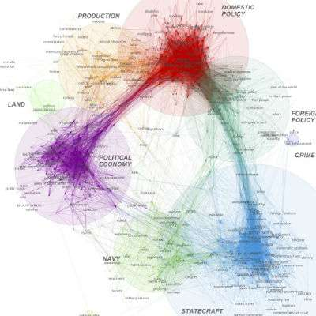

# 文本訊息視覺化

* 視覺化是資料科學的一個重點。
* 以數值訊息為主的作圖套件有很多，如 `ggplot2`, `ggvis`, `rCharts`, `d3Network`。

### 文字雲 Word cloud

* 製作簡易

## 文字雲之外的文字視覺化 Beyond the word cloud


### 

### 詞泡 Word bubble


### 詞網 Word Network


### 詞樹 word tree


## 線上工具試玩

* [wordle](visualization.md)

  ```text
  Wordles 單純對於詞作計量計算。
  字詞的排列不代表字詞之間的相關性。更複雜一點的想法之後聚類部分會談到。
  ```

* `treemap` of words. check [this tutorial](http://unixlab.sfsu.edu/~trogu/523/02_2013_fall/demo/treemap_key/treemap_legend_key_step-by-step.pdf)

## Linguistic Motion Charts

## 論證視覺化

[argüma sn](http://ch.arguman.org/ci-zhi-can-xuan-zhan-xian-fu-ze-ren-de-tai-du-zhen-de-you-zhe-mo-nan-ma-ru-guo-lian-zhe-mo-ji-ben-de-ge-ju-yu-jue-xin-du-mei-you-zhu-li-lun-ru-he-huan-neng-chi-yan-you-neng-li-dai-ling-zhe-ge-guo-jia)

## 文本的網路科學

* 文本的[【多奇異點】\(polysingularity\)](https://noduslabs.com/research/visualization-text-polysingularity-network-analysis/) 是一種較為神奇的觀點，要處理將動態複雜塞進線性敘事結構的過程。很有量子語言學的味道。

> This is a very important process, because it allows expression to be specific \(to the particular time and space\) and at the same time maintain co-isolated multiplicities \(the underlying experience of the text\). We call this process _**polysingularity**_ because it has several possible “solutions” that co-exist simultaneously and yet only one solution is available at each point of time and space for actualization \(Gabdulkhaev, 2005; Simonenko, 1965; Boikov, 2000\). Polysingularity emerges when our experience meets the commonly accepted notion of linear time. Therefore it’s an expression of a certain purpose from the multitude of simultaneously existing possibilities. The question of what is real gets a totally different aspect when we think of it in terms of polysingularity.

* 文本可以視為知覺與特定表達目的的介面。有很多的詮解可能同時存在，但一次一個。
* 18 秒的短期記憶。 


* 將文本表示成圖形 \(visual representation of text as a graph\) 的直接想法，是把詞當節點，之間的關係作為節點之間的鄰近性。
* [InfraNodus](http://infranodus.com/) open-source text to network visualization tool, where the text is scanned twice using 5- and 2-word “windows” that record co-occurrences between the words depending on their proximity to each other in these windows.


* 有無可能可以藉此看出主題結構 topical structure ? 群組情緒？

字詞的關聯網路可以某個程度揭示 **歷史觀** 



 [Big data analysis of state of the union remarks changes view of American History](http://phys.org/news/2015-08-big-analysis-state-union-remarks.html?utm_content=bufferc328f&utm_medium=social&utm_source=facebook.com&utm_campaign=buffer)

