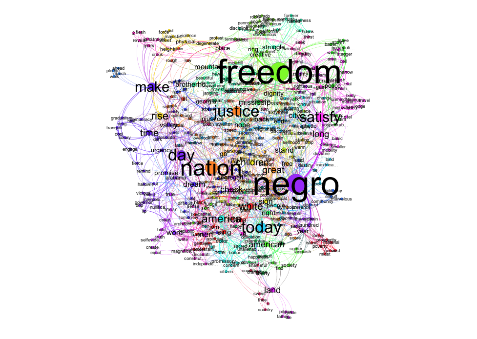

# 統計

## 基本概念

推薦兩本書：

* 簡單入門 》**統計學圖鑑**（栗原伸一與丸山敦史著，中譯 2019, 楓葉社）
* 程式實務角度 》Practical Statistics for Data Scientists \(Bruce and Bruce, 2017. O'Reilley.\)

### 描述統計

* 資料的平均數（算術、幾何、調和）
* 資料的離散
  * 分位數
  * 四分位距 \(Interquartile range, IQR\)
  * 離差 \(deviation\)
  * 變異數 \(variance\) 與標準差 \(standard deviation\)
  * 離群值 \(outlier\)
  * 變異係數 \(coefficient of variation\)


* 變數的相關
  * 相關係數 \(coefficient of correlation\)
    * Pearson 積差相關係數
    * Spearman 等級相關係數
    * Kendal 等級相關係數

```text
require(languageR)
require(GGally)

data(package="languageR")
head(ratings)

# 計算相關係數
cor(ratings$Frequency,ratings$FamilySize)
[1] 0.7075396

# 兩兩變數散佈圖
ggpairs(ratings[,c(2,3:4)])

```




  


### 推論統計

* 顯著 \(statistical significance\)

> Statistical significance is often mentioned, but its meaning is not well understood. When a result is significant, it means you are very confident that you are not making a false claim.\* Significance does not measure how likely you are to be missing something real, which is determined by the much less-used statistical power.\(Stuhl, 2015\)

