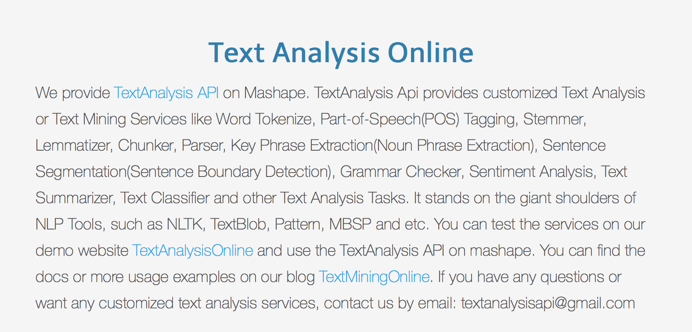

# 自然語言處理

* 目前的文本挖掘都必須是由 NLP 技術來強化。舉例：[http://textminingonline.com/](http://textminingonline.com/)



* NLP 的成熟與語言知識介入多深，決定了文本挖掘有趣到什麼程度。
* 商用的系統也出現不少。

## 自然語言處理技術重點

* 句法剖析 \(Syntactic Parsing\)/句塊抽取 \(Chunking\)
* 詞義排歧 \(Word Sense Disambiguation, WSD\)
* 共指消歧 \(Co-reference Resolution\)
* 命名實體辨識 \(Named Entity Recognition, NER\)

NLP 通常結合了各項**語言資源** \(language resources\)，如語料庫、詞彙知識庫 \(lexical knowledge base\)、知識本體 \(ontologies\) 等等來提升機器對於文本訊息的理解。

## 中文語言處理平台

* 卓騰語言科技[ Articut](https://api.droidtown.co)
* [語言雲](http://www.ltp-cloud.com)
* [玻森](http://bosonnlp.com/)

也可以利用 `Gate`平台，整合標記與自然語言處理模組來做。

## R 自然語言處理套件

[https://cran.r-project.org/web/views/NaturalLanguageProcessing.html](https://cran.r-project.org/web/views/NaturalLanguageProcessing.html)

* `openNLP`：Apache OpenNLP Tools Interface.
* `NLP`: Basic functions for Natural Language Processing.
* `coreNLP`：史丹佛大學自然語言處理工具集
* `KoNLP` 韓語自然語言處理
* `tmcn` 適應中文的 `tm` 改良，方便編碼轉換。
* `jiebaR`，`Rwordseg`中文斷詞

`openNLP` 和 `coreNLP` 是目前比較厲害的成果。以下用 [`coreNLP`](http://cran.r-project.org/web/packages/coreNLP) 為例

[http://github.com/statsmaths/coreNLP](http://github.com/statsmaths/coreNLP)

```text
devtools::install_github("statsmaths/coreNLP")
download.file("http://nlp.stanford.edu/software/stanford-corenlp-full-2015-01-29.zip")
unzip("stanford-corenlp-full-2015-01-29.zip")
```

```text
library(coreNLP)
initCoreNLP("stanford-corenlp-full-2015-01-29")
catInHat = c("the sun did not shine.", "it was too wet to play.","so we sat in the house all that cold, cold, wet day.")
output = annotateString(catInHat)
getToken(output)
getDependency(output)
getSentiment(output)
```

