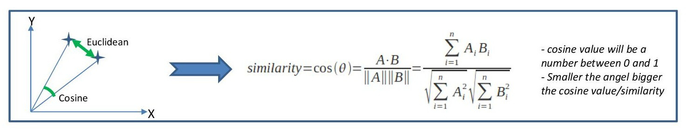
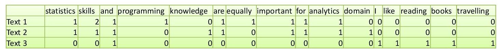
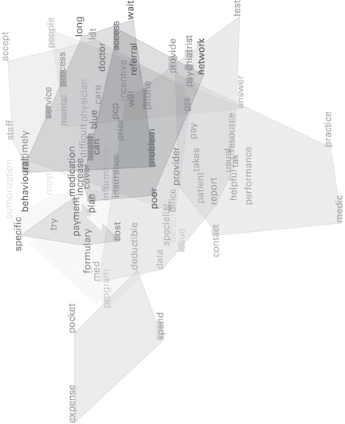
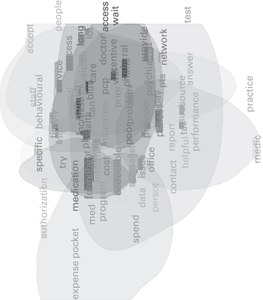

# 文本相似與關聯計算
Similarity and Association

## 文本相似度
- The concept of **similarity** is quite elusive.
- 先定義好在妳的應用中「相似」是什麼意思，再來想數學模式。

#### 文本相似度的幾何詮釋
- 把文本相似度的量度表徵為幾何空間的距離 (distance measure)，是常用的作法。
- `Cosine similarity` 被認為比 `Euclidean` 還有效率。[^1] 
以下計算 `cosine similarity` 的例子來自 [^2]
    

假設有三份文件，分別各只有一句話。

    Text 1: statistics skills and programming skills are equally important for analytics
    Text 2: statistics skills and domain knowledge are important for analytics
    Text 3: I like reading books and travelling

文詞矩陣`dtm` 就會長成這樣

三個文本的簡易向量表達就會是 
    
    T1 = (1,2,1,1,0,1,1,1,1,1,0,0,0,0,0,0)
    T2 = (1,1,1,0,1,1,0,1,1,1,1,0,0,0,0,0)
    T3 = (0,0,1,0,0,0,0,0,0,0,0,1,1,1,1,1)

將文本表徵成這樣，就可以用 `cosine similarity`來算它們之間的「相似度」。

$$sim(T1,T2) = (T1 * T2) / (\sqrt(\sigma(T1^2)) * sqrt(sum(T2^2))) = 77%
$$

$$
Degree of Similarity (T1 & T3) = (T1 %*% T3) / (sqrt(sum(T1^2)) * sqrt(sum(T3^2))) = 12%
$$

---
# 文本的幾何表徵

可以用 `LSAfun` (An R package for computations based on Latent Semantic Analysis) 來做入門練習。此套件使用了預先準備好了的 LSA 空間，提供以下功能 (Günther F et al. 2015)。如果要自行實際建構 LSA 空間，可使用 `lsa` 或其他套件。

- 詞彙、文本的相似度計算 (Similarity Computations between words, word lists, and documents)
 

    - Neighborhood Computations, such as obtaining a word's or document's most similar words, 
    - plotting such a neighborhood, as well as similarity structures for any word lists, in a two- or three-dimensional approximation using Multidimensional Scaling, 
    - Applied Functions, such as computing the coherence of a text, answering multiple choice questions and producing generic text summaries; and 
    - Composition Methods for obtaining vector representations for two-word phrases. 

## 多向度標示法 

多向度標示法 (Multi-Dimensional Scaling, MDS) 也是一種可以用在文本分析的多變量資料分析方法。特別是希望呈現處資料內的連續結構 (向度、因素等)，而非離散結構 (分類、分割等) 的時候。

- 常被運用在分析相似度
- Multidimensional scaling takes a table of similarities among words and turns it into a visual display like a map showing distances among words. And you can use a diagram called **word cloud** to display the results.

- 去摺 (unfolding) 原理可用來詮釋受試者對於物件偏好的潛在機制。將受試者和物件同時標示在同一個空間，受試者距離物件的遠近就反映他對物件的偏好程度。

- Extending word clouds with covers: 
Drawing boundaries around groups of words is one way to get some of this information. These boundaries are called **covers**. Covers surround the places in the chart where similar words congregate together.(Stuhl, 2015)

 

Word cloud with Kernel density covers

## 字詞的熱力圖

Heat maps of words

## 文本網路

Graph layout of words

---
[^1] [Space and Cosine Similarity measures for Text Document Clustering](http://www.ijert.org/view-pdf/2373/space-and-cosine-similarity-measures-for-text-document-clustering)

[^2] https://manoharswamynathan.wordpress.com/category/text-mining/
