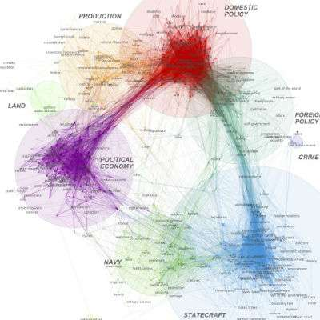

# 文本訊息視覺化


- 視覺化是資料科學的一個重點。
- 以數值訊息為主的作圖套件有很多，如 `ggplot2`, `ggvis`, `rCharts`, `d3Network`。


## 線上工具試玩

- [wordle]()
```
Wordles 單純對於詞作計量計算。
字詞的排列不代表字詞之間的相關性。更複雜一點的想法之後聚類部分會談到。
```

- `treemap` of words. 
check [this tutorial](http://unixlab.sfsu.edu/~trogu/523/02_2013_fall/demo/treemap_key/treemap_legend_key_step-by-step.pdf)


## Linguistic Motion Charts


<a href = "https://www.youtube.com/embed/6LUjgHPhxRw" target = "_blank"></a>


## 論證視覺化

[argüma sn](http://ch.arguman.org/ci-zhi-can-xuan-zhan-xian-fu-ze-ren-de-tai-du-zhen-de-you-zhe-mo-nan-ma-ru-guo-lian-zhe-mo-ji-ben-de-ge-ju-yu-jue-xin-du-mei-you-zhu-li-lun-ru-he-huan-neng-chi-yan-you-neng-li-dai-ling-zhe-ge-guo-jia)


## 文本網路
<http://noduslabs.com/research/pathways-meaning-circulation-text-network-analysis/>


字詞的關聯網路可以某個程度揭示 **歷史觀** [^1]





---
[^1] [Big data analysis of state of the union remarks changes view of American History](http://phys.org/news/2015-08-big-analysis-state-union-remarks.html?utm_content=bufferc328f&utm_medium=social&utm_source=facebook.com&utm_campaign=buffer)

